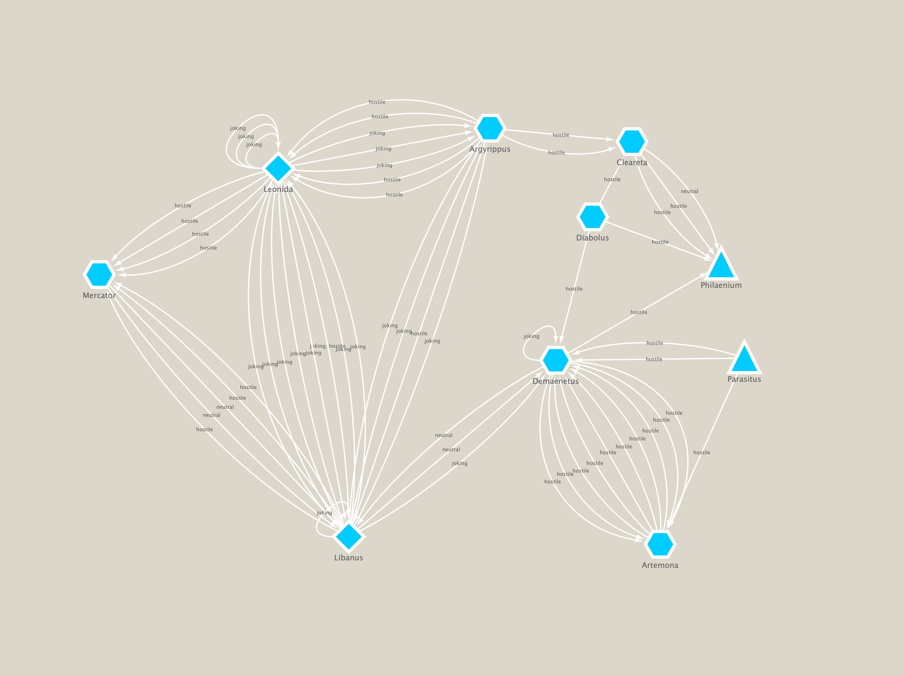

# Roman Comedy — Insult Interactions

Data on insult interactions among characters from the plays of Plautus and Terence. Collated
by hand, and (currently) put into CSV format.

## Project Goals:

* These tables began as nothing more than handy records for reference while writing my
  monograph. However they should be useful for a more formal (and sophisticated) analysis down
  the road.
* Once each play is analyzed and insult interactions are compiled, I hope to accomplish the
  following:
    1. Convert each table into a JSON document, for use in computer analysis.
    2. Document and extend the workflow for use with other dramatic corpora.
    3. Develop a methodology for analyzing insult interactions within corpora using the
       encoded data. E.g., both within individual plays, but also across the Plautine and
       Terentian corpora.
    4. Develop a workflow (or even semi-automated process) for mapping social-network
       interactions in the insult data.
        * E.g., see my related project: https://github.com/ancient-drama-SNA/Roman_Comedy-SNA.
        * Ideally, the final maps will [look something like this](https://ancient-drama-sna.github.io/Roman_comedy_networks/).

### In the meantime...

...the in-process tabular data can still be useful (and used).

* For example:
    - [Cytoscape](https://cytoscape.org) and [Gephi](https://gephi.org) can both generate SNA
      maps using data in these files.
    - [Stanford Palladio](http://hdlab.stanford.edu/palladio/) will generate useful
      visualizations from CSV date. (Just be sure to exclude metadata headers.)
    - Python can be used to generate static SNA maps; see for example the [excellent video
      tutorial series by WJB Mattingly](https://youtube.com/playlist?list=PL2VXyKi-KpYsjoY2rx9NiWJyfmmD79H97).
    - Or, just good, old-fashioned reading! The tables contain useful raw data for anyone
      working on insults and impoliteness in Roman comedy.

* An example Social Networking Analysis map:
   

## Roman Comedy 'Insult Tables' notes:

* As currently set up, the tables are encoded as CSV files.
    - The delimiter for each field is a comma.
    - Each has a 5-line header, which contains metadata.
    - Lines 1–3 are metadata related to the textual edition, and so on.
    - Line 4 is blank (separator).
    - Line 5 contains the column headers (= category labels).
    - If converted to e.g. JSON or some other format, header lines 1–4 need to be stripped.
      Line 5 should remain.
* For conversion, the `csvtojson` command-line tool seems to work well. (A `node` program.)
    - BUT: only works if the header/metadata is removed.

* _Methodological Notes:_
    - I am treating multi-line, multi-part insults as a single unit. That is, insults are
      demarcated by "chunks" of speech, assigned to a specific speaker. 
    - The only time I separate individual insult entries is when/if the speaker, in the
      course of a long speech, makes an insult, moves to another topic, and then begins
      another insult. Long strings of insults however are counted as a "chunk."

## Progress:

* Plays that have I have analyzed and documented so far.

* Plautus:
    - [X] Amphitruo
    - [x] Asinaria 
    - [X] Aulularia
    - [ ] Bacchides
    - [ ] Captivi
    - [ ] Casina
    - [ ] Cistellaria
    - [ ] Curculio
    - [ ] Epidicus
    - [ ] Menaechmi
    - [ ] Mercator
    - [ ] Miles Gloriosus
    - [ ] Mostellaria
    - [ ] Persa
    - [ ] Poenulus
    - [ ] Pseudolus
    - [ ] Rudens
    - [ ] Stichus
    - [ ] Trinummus
    - [ ] Truculentus
    - [ ] Vidularia (frags)
* Terence:
    - [ ] Andria
    - [ ] Hecyra
    - [ ] Heauton Timouromenos
    - [ ] Phormio
    - [ ] Eunuchus
    - [ ] Adelphoe
